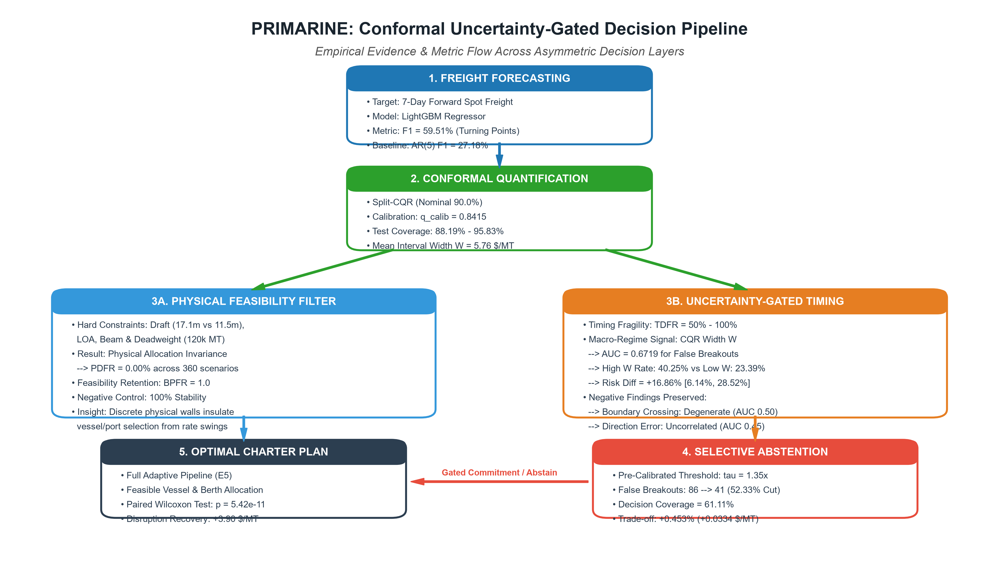

# PRIMARINE: Uncertainty-Aware Maritime Freight Decision Intelligence

<div align="center">



**Conformal Uncertainty-Gated Decision Support for Maritime Freight Procurement**

[](LICENSE)
[](prototype/)
[](docs/FINAL_PROJECT_STATUS.md)

</div>

---

## 1. What is PRIMARINE?

**PRIMARINE** is a research-backed **Uncertainty-Gated Freight Decision Support System** designed to solve a critical vulnerability in maritime freight procurement: *the catastrophic downstream cost of uncalibrated point-forecasts in high-stakes chartering under volatile market conditions.*

Commercial chartering desks traditionally rely on point estimates of spot freight rates. When sudden macro volatility induces a "false dip" (a *false breakout*), uncalibrated models recommend locking in expensive forward contracts. PRIMARINE introduces a distribution-free **Split Conformalized Quantile Regression (Split-CQR)** gating mechanism that quantifies forecast dispersion, guarantees finite-sample coverage, and selectively abstains from fragile procurement timing decisions.

```
FREIGHT FORECAST
        ↓
CONFORMAL PREDICTION INTERVAL
        ↓
UNCERTAINTY WIDTH (W = U - L)
        ↓
DECISION GATE (W vs tau = 5.9529)
        ↓
PROCEED / DEFER
```

---

## 2. Interactive Prototype Quickstart

The prototype is clean, data-driven, and runs directly in any modern browser via a local HTTP server:

```bash
# Navigate to the prototype directory
cd prototype

# Launch local HTTP server
python -m http.server 8000
```

Open **`http://localhost:8000`** (or `http://localhost:8000/ui/index.html`) in your browser.

- **Interactive Decision Tool:** `http://localhost:8000/ui/index.html`
- **Research Evidence & Visuals:** `http://localhost:8000/ui/research.html`

### Running Decision Engine Unit Tests

```bash
node prototype/tests/test_decision_logic.js
```

---

## 3. Four Reality States & System Status Matrix

To maintain strict scientific transparency, PRIMARINE explicitly categorizes all components into four distinct reality states:

| Subsystem / Capability | Reality State | Scientific & Implementation Status | Authoritative Reference |
| :--- | :--- | :--- | :--- |
| **Point Forecasting Benchmarks** | `1. VALIDATED RESEARCH` | LightGBM point MAE = `0.4644` vs Persistence = `0.4175` | [04_WHAT_WE_FOUND.md](docs/04_WHAT_WE_FOUND.md) |
| **Turning-Point Inflection Detection** | `1. VALIDATED RESEARCH` | **F1 = 59.51%** (+32.33 pp over AR-5 baseline) | [04_WHAT_WE_FOUND.md](docs/04_WHAT_WE_FOUND.md) |
| **Split-CQR Conformal Calibration** | `1. VALIDATED RESEARCH` | Nominal 90% coverage $\rightarrow$ **88.19%** test coverage ($q = 0.8415$) | [04_WHAT_WE_FOUND.md](docs/04_WHAT_WE_FOUND.md) |
| **Physical Feasibility Invariance** | `1. VALIDATED RESEARCH` | **PDFR = 0.00%** on tested dry-bulk draft/DWT constraints | [04_WHAT_WE_FOUND.md](docs/04_WHAT_WE_FOUND.md) |
| **Asymmetric Timing Fragility** | `1. VALIDATED RESEARCH` | **TDFR = 50.00%–100.00%** under uncertainty perturbations | [04_WHAT_WE_FOUND.md](docs/04_WHAT_WE_FOUND.md) |
| **False-Breakout Risk Association** | `1. CONTROLLED EXPERIMENT` | High W = 40.25% vs Low W = 23.39% ($\text{AUC} = \mathbf{0.6719}$, $p < 0.01$) | [04_WHAT_WE_FOUND.md](docs/04_WHAT_WE_FOUND.md) |
| **Selective Abstention Policy** | `1. CONTROLLED EXPERIMENT` | **-52.33% False Breakouts** ($86 \rightarrow 41$) at $\tau = 5.9529$ | [04_WHAT_WE_FOUND.md](docs/04_WHAT_WE_FOUND.md) |
| **Negative Results Preservation** | `1. NEGATIVE RESULT` | Spot Boundary Crossing $\text{AUC} = 0.5025$; Sign Error $\text{AUC} = 0.4487$ | [06_LIMITATIONS.md](docs/06_LIMITATIONS.md) |
| **Interactive Decision Prototype** | `2. PROTOTYPE IMPLEMENTATION` | Pure JS/HTML5 calculation tool on empirical BDI fixtures | [prototype/README.md](prototype/README.md) |
| **Provider Adapter Architecture** | `3. PLANNED ENGINEERING` | Decoupled abstract adapters for Baltic, AIS, Weather, PCS | [docs/api/](docs/api/) |
| **Production Cloud Backend** | `3. PLANNED ENGINEERING` | FastAPI microservices, TimescaleDB, FalkorDB Graph schema | [docs/PRIMARINE_PRODUCT_BLUEPRINT/](docs/PRIMARINE_PRODUCT_BLUEPRINT/) |
| **Global Real-AIS ST-GNN** | `4. FUTURE RESEARCH` | Multi-billion message satellite AIS graph neural network | [01_ORIGINAL_SYSTEM_VISION.md](docs/01_ORIGINAL_SYSTEM_VISION.md) |

---

## 4. Repository Structure

```
PRIMARINE/
├── README.md                               <-- Master Project Entry Point
├── LICENSE                                 <-- MIT License
├── CITATION.cff                            <-- Academic Citation Metadata
├── CHANGELOG.md                            <-- Version & Release History
├── PRIMARINE_FINAL_RELEASE_MANIFEST.md     <-- Release Inventory & Manifest
│
├── docs/                                   <-- Project & Engineering Documentation
│   ├── 00_PROJECT_OVERVIEW.md              <-- Executive Orientation
│   ├── 01_ORIGINAL_SYSTEM_VISION.md        <-- 8-Stage Enterprise Blueprint
│   ├── 02_RESEARCH_QUESTION.md             <-- Formal Research Questions
│   ├── 03_RESEARCH_JOURNEY.md              <-- Chronological Evolution
│   ├── 04_WHAT_WE_FOUND.md                 <-- Comprehensive Findings Summary
│   ├── 05_CURRENT_STATUS.md                <-- Component Verification Matrix
│   ├── 06_LIMITATIONS.md                   <-- Methodological & Operational Boundaries
│   ├── FINAL_PROJECT_STATUS.md             <-- Master 12-Section Status Audit
│   ├── RESEARCH_TO_PRODUCT_MAPPING.md      <-- Research-to-Product Matrix
│   ├── PROJECT_NAMING_AND_IDENTITY.md      <-- Naming Migration & Identity Guide
│   ├── images/                             <-- 31 High-Resolution Diagrams & Figures
│   ├── api/                                <-- API Integration & Adapter Specs
│   └── PRIMARINE_PRODUCT_BLUEPRINT/        <-- 16 Comprehensive Product Blueprints
│
└── prototype/                              <-- Interactive Research Prototype
    ├── README.md                           <-- Prototype Documentation & Quickstart
    ├── index.html                          <-- Root Prototype Launcher (Navigation Bar)
    ├── DATA_PROVENANCE.md                  <-- Empirical Testbed Data Lineage
    ├── DECISION_LOGIC.md                   <-- Exact Gating Formulas & Mathematical Spec
    ├── PROTOTYPE_LIMITATIONS.md            <-- Prototype Boundary & Scoping Document
    ├── TRACEABILITY.md                     <-- Claim & Code Cross-Reference
    ├── config/                             <-- Pre-calibrated Configuration (tau = 5.9529)
    ├── data/                               <-- Empirical BDI Evaluation Scenarios
    ├── logic/                              <-- Pure Calculation Engine (decisionEngine.js)
    ├── tests/                              <-- Automated Decision Logic Unit Tests
    └── ui/                                 <-- User Interface (app.js, style.css, research.html)
```

---

## 5. Citation

If you reference the PRIMARINE research findings, prototype, or architecture, please cite:

```bibtex
@article{PRIMARINE2026conformal,
  title={Conformal Uncertainty-Gated Decision Support for Maritime Freight Procurement},
  author={PRIMARINE Research Team},
  journal={Smart India Hackathon (SIH) Technical Concept Series},
  year={2026},
  url={https://github.com/pandagod-001/PRIMARINE}
}
```
