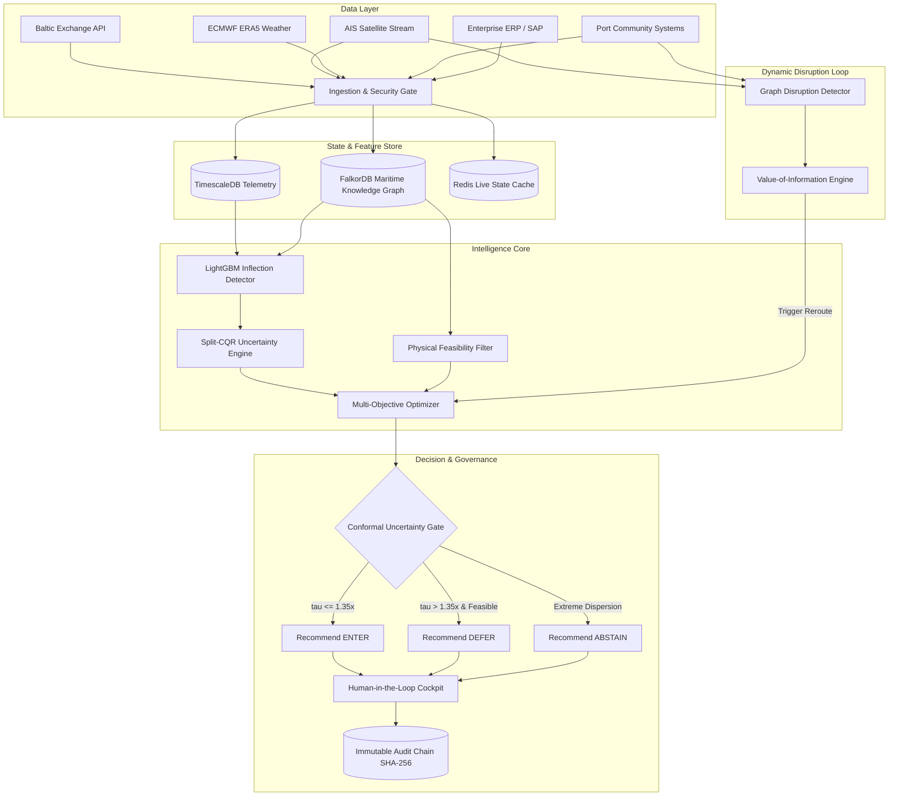

# PRIMARINE — Original System Vision & Enterprise Architecture

**Document Version:** 1.0.0 (Consolidated Blueprint)  
**Status:** Canonical Reference  
**Context:** The full enterprise vision originally conceived for the PRIMARINE Decision Intelligence Platform.

---

## 1. The Original Problem Statement

Global seaborne dry-bulk and container shipping represents over 80% of world trade by volume. Yet, commercial maritime freight procurement is plagued by three systemic failures:

1. **Uncalibrated Point-Forecast Fragility:** Chartering desks rely on single-number price estimates. In high-volatility regimes, point forecasts trigger premature commitments during false dips, causing millions in chartering loss.
2. **Physical-Financial Disconnect:** Financial freight models treat shipping as a frictionless commodity, ignoring hard physical realities (draft depths, tidal windows, berth congestion, crane outreach, and bunker endurance).
3. **Disruption Blindness:** Chokepoint closures (e.g., Red Sea, Panama Canal, Malacca Strait) and severe weather create cascading port congestion that static planning tools fail to anticipate or quantify.

PRIMARINE was originally designed as an end-to-end, real-time operating system to unify physical feasibility, predictive intelligence, conformal uncertainty quantification, and automated chartering decision support.

---

## 2. End-to-End Enterprise Architecture

---

## 3. Detailed Stage Breakdown

### Stage 1: Ingestion & Security Gate
- Ingests structured and unstructured data feeds across market rates, vessel positions, weather grids, and terminal schedules.
- Enforces strict outlier detection, schema validation, and timestamp verification to prevent data-poisoning or feed-interruption anomalies.

### Stage 2: Feature Store & Maritime Knowledge Graph
- Models global maritime topology as an attributed directed multigraph (Ports, Berths, Chokepoints, Corridors, Vessels).
- Stores dynamic vessel states (speed, heading, draft, cargo, fuel) and temporal market features.

### Stage 3: Predictive Intelligence & Conformal Bounds
- Extracts non-linear regime shift indicators.
- Employs Split-CQR to calculate non-parametric, finite-sample prediction intervals $[\hat{y}_{\text{low}}, \hat{y}_{\text{high}}]$ at guaranteed nominal marginal coverage.

### Stage 4: Physical Feasibility Engine
- Implements deterministic, non-negotiable operational filtering:
  $$\text{Feasible}(v, p) = \mathbb{I}(\text{Draft}(v) \le \text{MaxDraft}(p, t)) \times \mathbb{I}(\text{DWT}(v) \le \text{MaxDWT}(p)) \times \mathbb{I}(\text{Beam}(v) \le \text{MaxBeam}(p))$$
- Evaluates laycan compatibility, bunker range, and cargo-hold gear requirements.

### Stage 5: Multi-Objective Procurement Optimization
- Evaluates candidate charters against an Pareto frontier:
  $$\min \quad w_1 \cdot \text{FreightCost} + w_2 \cdot \text{TransitTime} + w_3 \cdot \text{DemurrageRisk} + w_4 \cdot \text{CarbonEmissions}$$

### Stage 6: Uncertainty-Gated Selective Prediction
- Enforces dynamic decision rules based on calibrated interval width $W_t = \hat{y}_{\text{high}} - \hat{y}_{\text{low}}$:
  - **ENTER:** $W_t \le \tau$ and cost savings projected $\rightarrow$ Lock in forward charter.
  - **DEFER:** $W_t > \tau$ and physical buffer exists $\rightarrow$ Wait for uncertainty resolution.
  - **ABSTAIN:** $W_t \gg \tau$ or high disruption probability $\rightarrow$ Flag for human procurement officer intervention.

### Stage 7: Human Governance & Cryptographic Audit
- Generates transparent, human-readable rationale cards detailing risk factors, conformal spread, and alternative routes.
- Commits all decisions to an immutable SHA-256 hash chain for corporate compliance, dispute resolution, and post-voyage audit.

### Stage 8: Real-Time Disruption & Adaptive Re-Ranking
- Continuously tracks cascading port delays and weather fronts.
- Evaluates Value-of-Information (VoI): triggers automated re-ranking only if expected cost savings of re-optimization exceed transaction and rerouting costs.

---

## 4. Relationship Between Product Vision and Current Research

The completed scientific research program ([research/PRIMARINE_RESEARCH_PACKAGE/](file:///c:/Users/Abhijay/PRIMARINE/research/PRIMARINE_RESEARCH_PACKAGE/)) represents a rigorously investigated, empirically validated subset of this enterprise architecture: specifically validating **Stages 3, 4, 5, and 6** on benchmark historical freight datasets and physical dry-bulk fixtures.
