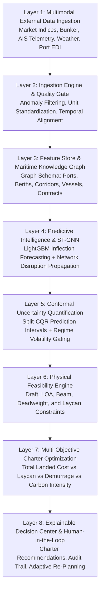

# PRIMARINE — Original Product Vision & System Purpose

**Document:** `docs/PRIMARINE_PRODUCT_BLUEPRINT/01_ORIGINAL_PRIMARINE_VISION.md`  
**Problem Statement:** SIH 2026 PS-26006 (Ministry of Steel, Government of India)  
**Classification:** Product Architecture Specification  

---

## 1. Executive Summary & Original Problem

Indian steel manufacturers and state energy utilities import over **70+ million metric tonnes** of coking coal and raw minerals annually from overseas origins (Australia, Indonesia, South Africa, Mozambique, North America) to the East Coast of India (Paradip, Visakhapatnam, Haldia, Dhamra, Gopalpur).

### The Real-World Industrial Challenge:
In overseas bulk shipping:
1. **Capital Scale:** A single Capesize vessel carries $\approx 150,000\text{ MT}$ of cargo with freight bills ranging between $\$2.5\text{M}$ and $\$4.0\text{M}$.
2. **Extreme Freight Volatility:** Spot freight rates regularly experience abrupt double-digit percentage swings within 5–7 days due to macro commodity cycles, bunker fuel spikes, and regional port bottlenecks.
3. **Rigid Physical Constraints:** Ships cannot enter just any port. Physical parameters—such as vessel laden draft versus berth depth, Length Overall (LOA), beam outreach, and port conveyor discharge rates—strictly constrain which ships can dock.
4. **The "Predict-Then-Optimize" Silo:** In standard industry practice, econometric point forecasts operate in total isolation from physical port scheduling. A chartering manager might receive a forecast saying *"freight is rising,"* commit to a vessel class, and then discover that seasonal monsoon siltation at the discharge port causes ₹1.5 Crores in demurrage penalties and forced transshipment.

---

## 2. The Original Intended Solution: PRIMARINE

**PRIMARINE** was conceived as an end-to-end, human-in-the-loop **Maritime Freight Decision Intelligence System**. 

The fundamental goal is not merely to display ships on a map or predict a freight number in isolation, but to solve the complete **chartering decision chain**:

$$\text{Requirement Ingestion} \longrightarrow \text{Market Intelligence} \longrightarrow \text{Uncertainty Quantification} \longrightarrow \text{Physical Berth/Draft Validation} \longrightarrow \text{Multi-Objective Optimization} \longrightarrow \text{Explainable Recommendation} \longrightarrow \text{Adaptive Disruption Re-Planning}$$

> **Important Clarification:**  
> The recently completed research program (*Forecast-to-Decision Fragility and Conformal Selective Abstention*) investigated and validated a specific, critical decision-intelligence component **inside** this much broader PRIMARINE system architecture.

---

## 3. Complete System Architecture & Layer Breakdown

The complete intended PRIMARINE platform is structured into 8 functional layers:

### Layer-by-Layer Intended Capabilities:
1. **Multimodal Data Ingestion:** Automated aggregation of spot freight indices (BDI, BCI, BPI, BDRY), bunker fuel prices (Brent, VLSFO), mining equity proxies (BHP, Vale), currency pairs (USD/INR, DXY), satellite AIS positions, and weather advisories.
2. **Data Quality & Validation Gate:** Statistical anomaly detection, z-score outlier filtering, cross-market holiday forward-filling, and temporal alignment without future lookahead.
3. **Maritime Knowledge Graph & Feature Store:** A graph database representing the physical topology of ports, draft limits, berths, sea corridors, vessel specifications, and historical fixtures.
4. **Predictive Intelligence & ST-GNN:** Point and quantile models predicting 7-day cumulative rate movements ($\ge \pm 4\%$) coupled with a Spatio-Temporal Graph Neural Network for corridor-level congestion propagation.
5. **Conformal Uncertainty Quantification:** Model-agnostic prediction intervals (Split-CQR) providing distribution-free coverage and selective abstention gating during erratic market expansions.
6. **Physical Feasibility Engine:** Automated hard-filtering of vessel-port-cargo permutations against physical drafts, LOA, beam, and parcel deadweight limits.
7. **Multi-Objective Optimization Solver:** Evaluates feasible candidates across total landed cost per metric tonne, turnaround duration, demurrage exposure, and CII carbon ratings.
8. **Explainable Decision Center & Adaptive Loop:** Interactive dashboard presenting transparent rationale for recommendations (`ENTER_NOW`, `DEFER`, `ABSTAIN`), enabling human charterers to approve plans, simulate counterfactuals, and adapt dynamically when port disruptions strike.

---

## 4. Target Users & Intended Decision Workflow

### Primary Users:
- **Central Procurement & Logistics Teams:** SAIL (Steel Authority of India Ltd), Rashtriya Ispat Nigam Ltd (RINL), NTPC, Tata Steel.
- **Port Operations Planners:** Managing berth allocations and discharge queues.
- **Chartering & Freight Risk Managers:** Hedging physical cargo fixtures against freight derivative swings.

### Intended End-to-End User Journey:
1. **Shipment Creation:** User inputs cargo volume ($120,000\text{ MT}$ coking coal), origin (Hay Point, Australia), destination (Paradip, India), and required laycan window.
2. **Feasibility Validation:** PRIMARINE scans candidate fleet registers and port berth registers, rejecting vessels exceeding maximum draft or LOA.
3. **Market & Uncertainty Evaluation:** The system generates forward rate forecasts, calibrates conformal intervals, and evaluates macro-volatility width.
4. **Action Synthesis:** If uncertainty is high, PRIMARINE advises `ABSTAIN` (dollar-cost average / neutral spot fixture). If rates are forecast to rise safely, it recommends `ENTER_NOW` with optimal vessel and routing.
5. **Human Approval & Audit:** Chartering manager reviews the transparent rationale, modifies parameters if desired, and logs the decision.
6. **Continuous Monitoring & Adaptation:** If a cyclone shuts Hay Point or draft siltation occurs at Paradip, PRIMARINE alerts the user and recalculates feasible alternatives (e.g., re-routing to Visakhapatnam).
