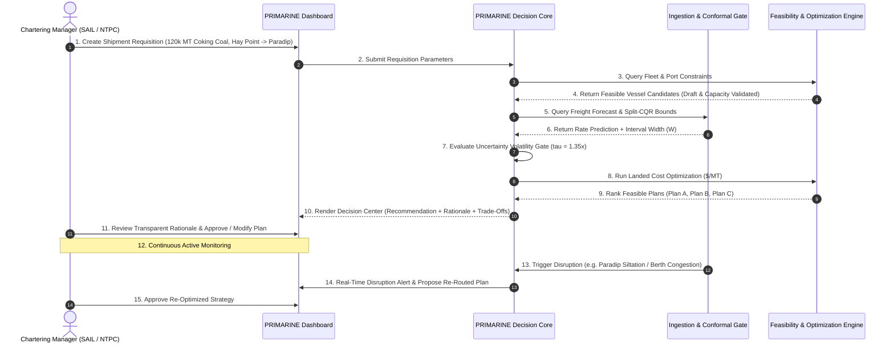

# PRIMARINE — End-to-End User Experience & Operational Workflow

**Document:** `docs/PRIMARINE_PRODUCT_BLUEPRINT/07_USER_WORKFLOW.md`  
**Classification:** User Journey Specification & UX Architecture  

---

## 1. Executive Summary

PRIMARINE is designed as a **Human-in-the-Loop Decision Support System**. It does not execute legally binding multi-million dollar charter fixtures autonomously; rather, it empowers chartering managers, logistics coordinators, and procurement directors with mathematically validated, uncertainty-aware intelligence.

---

## 2. Step-by-Step User Journey

---

## 3. Detailed Phase Breakdown

### Phase 1: Requisition Definition
- **User Action:** The logistics officer selects or creates a shipment instance:
  - **Commodity:** Australian Premium Hard Coking Coal.
  - **Volume:** $120,000\text{ MT} \pm 10\%$.
  - **Origin:** Hay Point Terminal (Queensland, Australia).
  - **Destination:** Paradip Port (East Coast India).
  - **Laycan Window:** Required delivery within 25–30 days.

### Phase 2: Automated Feasibility Filtering
- **System Action:** PRIMARINE scans available fleet registers.
  - *Panamax (75k DWT):* Rejected (Capacity shortfall for 120k parcel).
  - *Supramax (58k DWT):* Rejected (Capacity shortfall).
  - *Capesize Standard (150k DWT, 15.2m draft):* **Feasible** at Paradip ($17.1\text{m}$ max draft).
  - *Capesize Modern (180k DWT, 16.8m draft):* **Feasible** at Paradip ($17.1\text{m}$ max draft).

### Phase 3: Forward Market Intelligence & Conformal Gating
- **System Action:**
  - Forward 7-day rate forecast: Rising ($+\$0.65/\text{MT}$).
  - Conformal prediction interval: $[L, U] = [\$6.80, \$12.56]$.
  - Interval width $W = \$5.76/\text{MT}$.
  - Uncertainty Check: $W \le \tau_{\text{calib}}$ ($5.95$) $\longrightarrow$ **Low/Moderate Volatility Regime**.
  - Decision Generated: **`ENTER_NOW` (Rising Market Ahead)**.

### Phase 4: Transparent Recommendation Delivery
- **UI Display:**
  - **Primary Recommendation:** Charter *V2 Capesize Standard* via Hay Point $\rightarrow$ Paradip direct.
  - **Total Landed Cost:** **$\$19.34/\text{MT}$** (includes charter hire, bunker fuel, port dues, handling charges).
  - **Explanation:** *"Optimal landed cost with 100% draft compliance (15.2m vs 17.1m limit). Forward market momentum supports entering market now to avoid an estimated +$0.65/MT price surge."*

### Phase 5: Adaptive Disruption Handling
- **Event:** Paradip Port issues a draft reduction notice (monsoon siltation reduces draft to $13.0\text{m}$).
- **System Reaction:**
  - Instantly flags Plan A as **PHYSICALLY INFEASIBLE** (Capesize draft $15.2\text{m} > 13.0\text{m}$).
  - Automatically re-optimizes across alternative East Coast ports.
  - Recommends **Plan B:** Re-route to Visakhapatnam Deepwater Berth ($16.5\text{m}$ draft) at **$\$19.55/\text{MT}$**, saving **$\$14.79/\text{MT}$** over forced shallow transshipment penalties.
