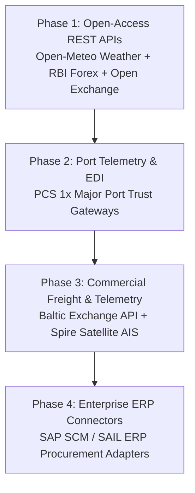

# PRIMARINE — Future API Integration & Commercial Provider Roadmap

**Document:** `docs/PRIMARINE_PRODUCT_BLUEPRINT/10_FUTURE_API_INTEGRATION_ROADMAP.md`  
**Classification:** Post-Selection Integration Blueprint  

---

## 1. Executive Summary

This roadmap defines the **step-by-step technical plan** to connect PRIMARINE with live commercial APIs following SIH selection and project funding.

> **Status:** All integrations below are planned for post-selection implementation. Current prototype operations rely entirely on curated static provider adapters.

---

## 2. Phased Integration Plan

### Milestone Breakdown:
1. **Tier 1 (Month 1–2): Free & Open-Access External Streams**
   - *Weather:* Open-Meteo REST API (hourly wind, wave height, and storm alerts).
   - *Currencies:* Reserve Bank of India (RBI) Reference Rates + OpenExchangeRates.
   - *Crude Benchmarks:* Yahoo Finance / AlphaVantage REST connectors.
2. **Tier 2 (Month 3–4): National Port Community Integration**
   - *Port Community System (PCS 1x):* Ingest live berth occupancy and anchorage waiting queues from Paradip Port Trust and Visakhapatnam Port Authority.
3. **Tier 3 (Month 5–6): Enterprise Commercial Telemetry**
   - *Freight Indices:* Baltic Exchange API subscription (BCI 180k Capesize, BPI 82k Panamax indices).
   - *Satellite AIS:* Spire Maritime WebSocket stream for real-time Capesize/Panamax vessel positions.
4. **Tier 4 (Month 7+): Enterprise ERP & Procurement Automation**
   - *SAP / Oracle SCM:* Automated ingestion of plant coal requisition tickets and automated charter fixture logging.
